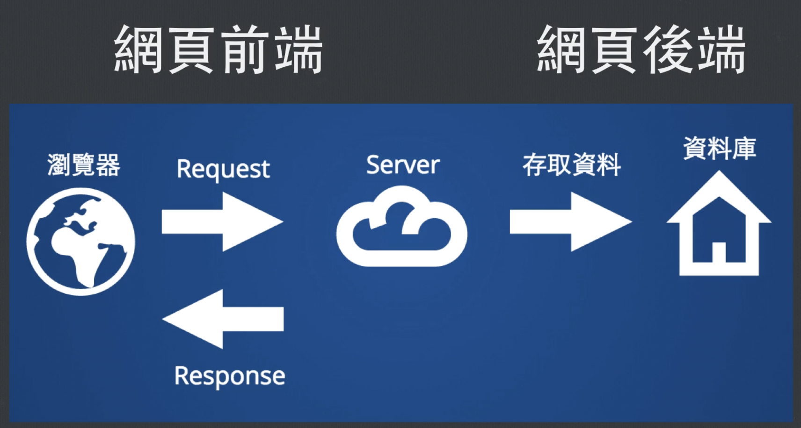

# Week2

## 課程初心者的記概與 coding 火球術

### 獲得時間

> date

### 印出所有 process (Table Of Process)

> top

### 印出檔案內容 Catenate

可以把該檔案的內容都印出來

> cat <要連接的檔案名稱>

### 分頁是印出檔案 less

相比於 cat，less 可以使用分頁式的印出檔案，在檔案內容大的時候特別好用。

> less <要分頁式印出的檔案名稱>

### 抓取特定關鍵字

> grep <要抓取的關鍵字> <要抓取的檔案名稱>

### 印出字串 echo

> echo <要印出的字串>

---

## 學習網路基礎概論 4-1~4-2

---

### IP 位置

都是由四個數字組成，範圍是 0~255
EX:101.13.113.80

---

### 域名 (Domain)

就是我們常用的網址，比起 IP 位置可讀而且好記
EX:google.com

---

### Domain Name System

把域名轉成 IP 位置的系統

---

### 網頁前後端差異

## 

---

### Virtual Private Network(VPN)

有些服務會鎖 IP，只開放特定 IP 可以存取，
這樣的目的是為了提升安全性，讓一些管理系統只能從公司內部登入，
，但是假如不在公司，可以透過 vpn，先連到公司內部，再從公司內部連到其他地方。

=============
目前看到這：

https://lidemy.com/courses/389485/lectures/5942922

https://github.com/ClayGao/My-study/tree/master/Lidemy/week1-4/week1-3

https://github.com/Lidemy/mentor-program-5th-Wangpoching
